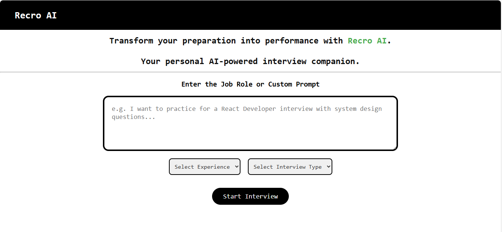
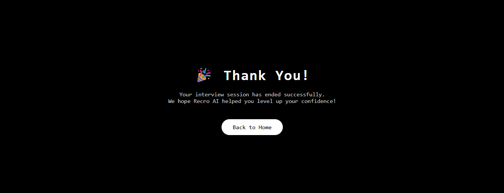

# 🤖 Recro AI

Got troubled in final interviews? 😣  
Want practice for real-time interviews? 🎤  
Craving for **customized interview questions** based on your skills and experience? 💡  
**We got you covered!** 💼🎯

**Recro AI** is your intelligent mock interview companion that simulates an actual interviewer using AI. It's tailored to your experience, your domain, and your unique needs — all inside your browser with no sign-up!

---

## ✨ Features

✅ **Customized Interviews**  
Set your domain, experience, and prompt — and get exactly the kind of interview you need!

🧠 **Smart One-by-One Questioning**  
No overwhelming dumps. Questions come one at a time — like a real interview.

💬 **Natural Conversational Flow**  
The AI waits for your response before continuing — mimicking real interactions.

🖥️ **Easy-to-Use Chat Interface**  
Clean and minimal chat UI for focused discussions.

🔐 **No Login Required**  
Jump straight into your practice interview — no accounts, no hassle.

---

## 🔮 Future Advancements

🚀 **Answer Evaluation** – Get feedback and suggestions on your responses.  
📄 **Export as PDF** – Save your interviews for review or portfolio.  
📊 **Progress Tracker** – Analyze your growth over multiple sessions.  
🌍 **Multi-Model Support** – GPT, Gemini, Claude — pick your AI brain!  
🧑‍💼 **Role-Based Interviews** – Choose roles like SDE, PM, Analyst, etc.

---

## 🚀 See it Live

🔗 [Recro AI](https://recro-ai.netlify.app)

---

## 📸 Screenshots

<!-- > Replace with your actual screenshot for best impact! -->

---

## 👨‍💻 Developed By

- [@ApoorvSaxena](https://github.com/Apoorv-Saxena08)

---

## 📁 Tech Stack

- HTML, CSS, JavaScript  
- Google Gemini 1.5 Flash API  
- SweetAlert2 for alerts  
- Netlify for deployment

---

## 💬 Feedback or Contributions?

Feel free to open an issue or submit a PR!  
Let’s make interview prep smarter, together. 🤝
